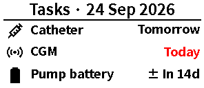
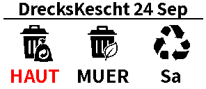

# Home Assistant e-ink display blueprints

Reusable Home Assistant **script blueprints** for 2.9-inch (296×128) BWR BLE electronic shelf labels.

They use the actively maintained [`BLE ESL`](https://github.com/eigger/hass-ble-esl) integration and its `ble_esl.write_guarded` action. The older `hass-gicisky` integration was archived in September 2026; use BLE ESL instead.

## Included blueprints

- [Diabetes maintenance display](https://github.com/defuuss/home-assistant-eink-blueprints/blob/main/blueprints/script/diabetes_maintenance_eink.yaml) — catheter, CGM, and pump-battery replacement information.
- [Waste collection schedule](https://github.com/defuuss/home-assistant-eink-blueprints/blob/main/blueprints/script/waste_collection_eink.yaml) — the next three Waste Collection Schedule pickups.

## Diabetes maintenance display

- Catheter due status
- CGM due status
- Predicted pump-battery empty date
- Red emphasis for overdue or due-within-24-hours items

The display is sent to every device selected in the blueprint, so the same information can be mirrored across multiple labels.

### Common requirements

1. Home Assistant with the **BLE ESL** custom integration installed via HACS.
2. One or more paired 2.9-inch 296×128 BWR labels supported by BLE ESL.
3. A Bluetooth adapter or ESPHome Bluetooth proxy that can reach the labels.

### Install

1. Import [diabetes_maintenance_eink.yaml](https://github.com/defuuss/home-assistant-eink-blueprints/blob/main/blueprints/script/diabetes_maintenance_eink.yaml) from Home Assistant’s **Blueprint import** screen, or copy it to `/config/blueprints/script/<your-folder>/`.
2. Create a script from **Diabetes maintenance e-ink display**.
3. Select one or more displays and four ISO-datetime sensor entities: catheter due, CGM due, pump-battery percentage, and predicted pump-battery-empty time.
4. Run the generated script when a source sensor changes, or on a scheduled refresh.

The blueprint uses `ble_esl.write_guarded`: with BLE ESL's **Prevent Duplicate Send** option enabled, unchanged frames are skipped and bursts of sensor updates are coalesced. This reduces BLE traffic and avoids redundant e-ink refreshes. Set the integration's debounce delay to suit the update frequency you want.

### Diabetes-display preview



`examples/diabetes_maintenance_eink.yaml` shows the resulting script configuration. It deliberately contains placeholders instead of device IDs or personal sensor names.

## Waste collection schedule

### Install

1. Import [waste_collection_eink.yaml](https://github.com/defuuss/home-assistant-eink-blueprints/blob/main/blueprints/script/waste_collection_eink.yaml) from Home Assistant’s **Blueprint import** screen, or copy it to `/config/blueprints/script/<your-folder>/`.
2. Create a script from **Waste collection e-ink schedule**.
3. Select the display or displays and all relevant Waste Collection Schedule sensors. Their numeric states must be the days until collection.
4. Run the generated script when a waste sensor changes and once just after midnight, so the `Today`/`Tomorrow` text stays current.

The blueprint sorts all selected sensors by their numeric state, shows the closest three collections, and turns a pickup red when it is today or tomorrow. Its five category images are bundled under [`assets/waste/`](assets/waste/) and loaded through public raw GitHub URLs, so users do not need to copy image files into `/config/www`. The matching recognizes `bio`/`organic`, `valorlux`/`packaging`, `recycling`, `paper`/`glass`, and falls back to general waste.

### Waste-display preview



`examples/waste_collection_eink.yaml` shows the resulting script configuration with generic, replaceable sensor names.

## Refresh automation

Create an automation that calls the generated script when any source sensor changes, plus a daily time trigger if you want the `Today`/`Tomorrow` labels to roll over at midnight.

For the waste blueprint, use the selected waste sensors as the state triggers and retain the same midnight time trigger.

```yaml
triggers:
  - trigger: state
    entity_id:
      - sensor.catheter_next_change
      - sensor.carelink_sensor_timer
      - sensor.pump_battery_level_valid
      - sensor.pump_battery_predicted_empty_at
  - trigger: time
    at: "00:01:00"
actions:
  - action: script.diabetes_maintenance_display
mode: single
```

## Sharing

These are script blueprints, not scenes. Script blueprints are the portable Home Assistant format for reusable, configurable display actions. Import them from the GitHub links above in Home Assistant’s Blueprint import screen, or copy them to your local `blueprints/script/` folder.

Do not commit Home Assistant `.storage`, access tokens, Bluetooth device IDs, or health data. The blueprint itself has no personal IDs or credentials.

## License

MIT. See [LICENSE](LICENSE).
